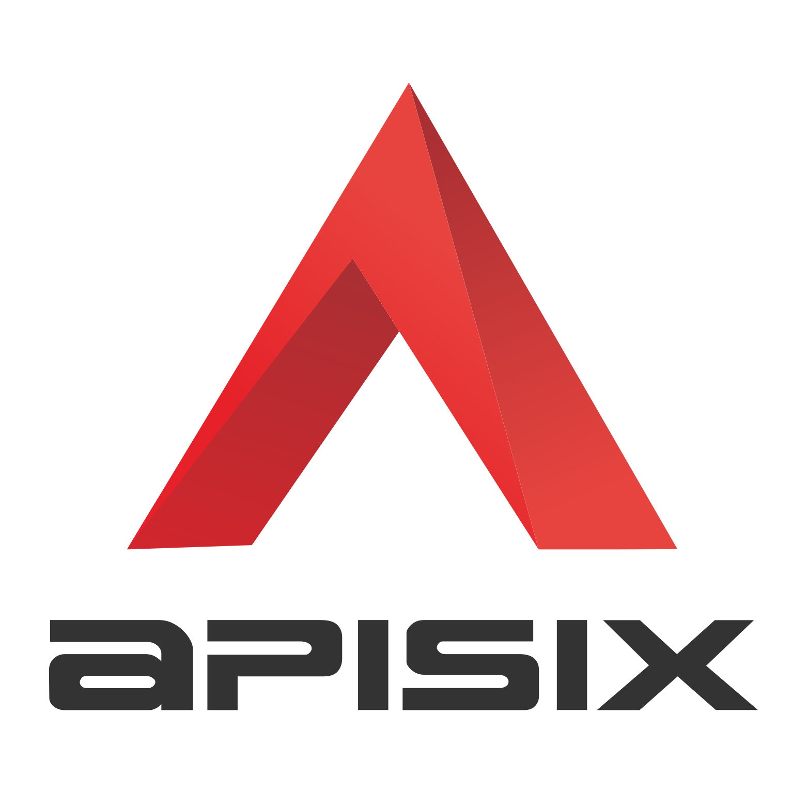

# Apisix CI/CD pipeline

Deploy Apisix server with CI/CD on Elestio

 
 

# Once deployed ...

You can open Apisix ADMIN UI here:

    URL: https://[CI_CD_DOMAIN]
    login: "root"
    password: [ADMIN_PASSWORD]

# Configuring your apisix.yml

This guide will walk you through the steps to configure your `apisix.yml` file for seamless integration with your environment.

## Step 1: Accessing VS Code

1. Navigate to the Tools tab.
2. Click on the VS Code button.
3. Copy the provided password.
4. Click on the Access link.
5. Paste the copied password when prompted.

## Step 2: Modifying apisix.yml

Once you have accessed VS Code, you can modify your `apisix.yml` file directly. No need to restart your stack, changes will be automatically updated.

# API

You can access your API endpoint using the curl command.

Example:

    curl "https://[CI_CD_DOMAIN]/test"
